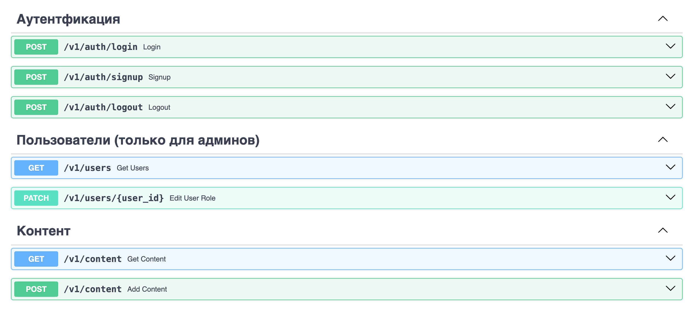

# content_storage

#### Стек: Python, FastAPI, uvicorn, SQLModel, postgresql, pyjwt, redis, py-bcrypt, asyncpg

## О проекте
Этот проект представляет собой веб-приложение(backend) для хранение файлов с аутентификацией пользователей.

## Запуск проекта

Для запуска проекта необходимо: 
* Установите Docker согласно инструкции с официального сайта: https://docs.docker.com/
* Клонировать репозиторий
```
git clone git@github.com:pashpiter/content_storage.git
```
* Перейти в папку content_storage
```
cd content_storage
```
* В папке создайте файл `.env` с переменных окружения
```
touch .env
```
* Заполните по примеру своими значениями как в этом [файле](example.env)
* Для запуска проекта введите команду:
```
docker compose up -d
```
или если локально установлен Make:
```
make up
```
> **После запуска, в приложении будет уже содзданный пользователь с email = `ADMIN_EMAIL` \
и пароль = `ADMIN_PASSWORD` из `.env` файла.**
## Документация
После запуска документация доступна по адресу:
```
127.0.0.1:8000/docs
```
или
```
127.0.0.1:8000/redoc
```
## Энодпоинты API


#### Pavel Drovnin [@pashpiter](http://t.me/pashpiter)